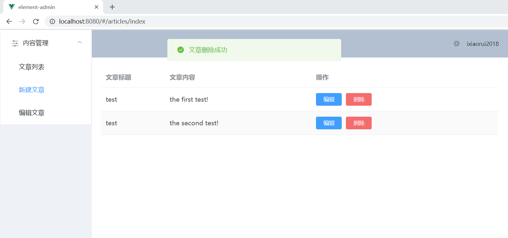

# expressLearn
### express的学习笔记!
### 基于express+MongonDB做服务端,Vue+element-ui做前端的简单后台管理界面开发!

#### 项目初始化设置
```
npm install
```

#### 全局安装nodemon
```
cnpm install -g  nodemon
```

#### 启动服务端
```
nodemon server
```

#### 启动前端界面服务
```
npm run serve
```

#### 浏览器输入以下网址进入后台管理界面
```
http://localhost:8080/
```

#### 演示图片

##### 文章列表


##### 新建文章
